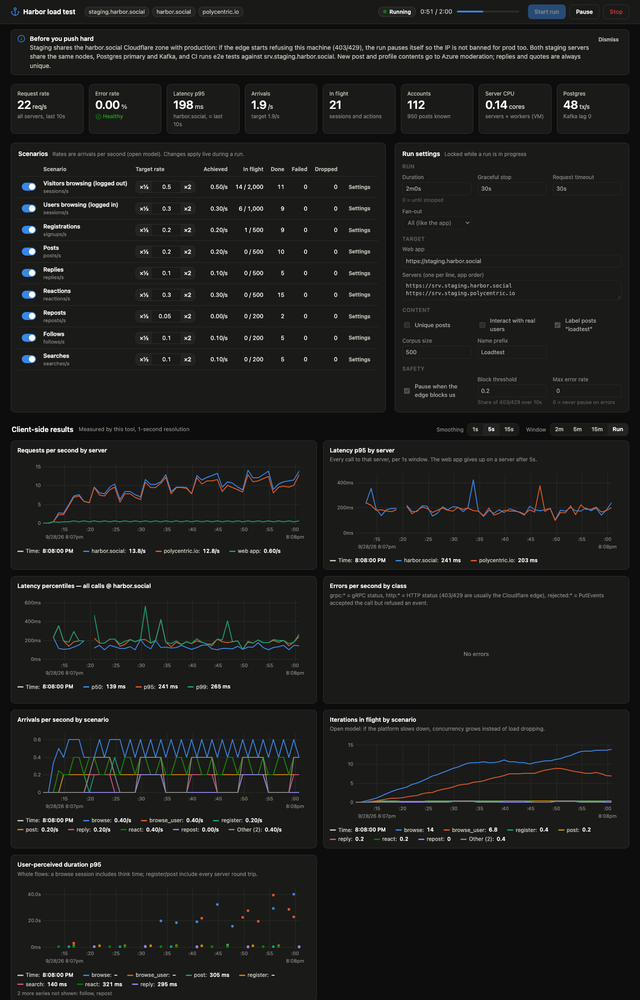

# harbor-loadtest

Load testing for Harbor staging. It simulates people browsing, signing up, posting, replying, reacting,
reposting, following and searching, at rates you set and can change mid-run.
A live dashboard shows what the clients experience next to what the platform
is doing (CPU, memory, gateway, per-RPC server traffic, DB pools, Postgres,
Kafka lag, workers), pulled from the staging VictoriaMetrics.



It speaks the same protocol as the web app: gRPC-Web to both seed servers,
events signed exactly as the client signs them, JWTs on logged-in requests,
CORS preflights from fresh browsers, and image loads for the rows a browser
would render. Load-test posts render in the real app ("Posted with
harbor-loadtest").

## Quick start

Requires Go 1.25+. Platform metrics need the netbird network; everything
else works without it.

```sh
cd dev/loadtest
make build                                   # → bin/harbor-loadtest
bin/harbor-loadtest smoke                    # one of everything, then checks it is visible on both servers
bin/harbor-loadtest run -open                # dashboard on http://127.0.0.1:8089; press Start run
bin/harbor-loadtest run -c configs/baseline.yaml -open
bin/harbor-loadtest run -c configs/ramp.yaml -headless   # no UI: progress every 10s, summary at the end
```

`run` flags: `-c` config, `-listen` (default `127.0.0.1:8089`), `-start`
(start immediately), `-headless`, `-open`, `-duration` (override
`run.duration`).

Other commands:

| Command | What it does |
|---|---|
| `smoke [-only a,b]` | Runs each scenario once and verifies new identities and posts on every server; non-zero exit on failure |
| `accounts [-ids \| -kubectl]` | Lists the identities this tool created, or prints operator commands that purge them |
| `cleanup [-yes]` | Deletes every load-test post by publishing signed Delete events (dry run without `-yes`) |
| `init [file]` | Writes a fully commented reference config |

## What it simulates

Rates are **arrivals per second** (an open model). Iterations start on
schedule no matter how long earlier ones take, so a slowing platform shows
up as rising concurrency and latency rather than quietly less load. Arrivals
beyond a scenario's `maxInFlight` are dropped and counted.

Every RPC goes to **every seed server in parallel**, as the app does:
`srv.staging.harbor.social` (namespace `harbor-server`) and
`srv.staging.polycentric.io` (`harbor-server-alt`). `target.fanout: first`
isolates one backend.

| Scenario | Unit | Request pattern (per server unless noted) |
|---|---|---|
| `browse` | sessions/s | GET web app HTML (harbor-web); `GetExploreFeed` (50, Top or Latest); blobs for the ~12 rows mounted (first server only, cached per tab); think; per scroll step: next page from every server with its own cursor, blobs for 15 more rows; sometimes `GetPostThread`, or a profile (`GetProfile` + `GetIdentityFeed`). Fresh browsers send CORS preflights (and optionally fetch the JS/CSS/fonts). |
| `browse_user` | sessions/s | Leases a load-test account. Boot sync (`ListEvents` with heads, alongside `ListHeads`); `IsModerator`; lands on Following (Latest) / For you / Explore; `SuggestFollow`; scrolls like `browse`; sometimes threads, profiles (with `IsModerator` again) and `ListNotifications`. Every request carries a JWT. |
| `register` | signups/s | New key; genesis identity event (`ListHeads` → `PutEvents`); profile update with a display name, synced (`ListEvents` pull alongside `ListHeads` → `PutEvents`); optionally follows N load-test accounts; loads the logged-in feed. |
| `post` | posts/s | Text post from the corpus; sometimes an image (JPEG 512/1280 variants uploaded to every server with `UploadBlob`), a quote, or a mention of a load-test account; synced as above. |
| `reply` | replies/s | Reply to a recent load-test post (root + parent). |
| `react` | reactions/s | Emoji reaction (mostly positive) on a recent post; `targetSkew` controls hot-post contention. |
| `repost` | reposts/s | Repost of a recent post. |
| `follow` | follows/s | One load-test account follows another. |
| `search` | searches/s | `SearchPosts` or `SearchUsers`. |

The call scripts come from reading the web client (`packages/rs-core`,
`apps/harbor`). Worth knowing when you set rates:

- Feed rows carry their authors' profiles and counts in `event_hints`, so rendering a post costs only image GETs.
- The web client has no background polling.
- A scroll step fetches the next page from every server even when the client still has unshown posts.

Events are built as the Harbor client builds them:

- `identity_sequence` and a vector clock that the client's read-side validation accepts;
- `previous_signature` and the RFC 6962 `previous_root`, kept incrementally;
- `application = harbor-loadtest`.

The server checks less than the client: it accepts events the client later drops (e.g. a wrong `identity_sequence` or vector clock). Everything here is verified by `smoke`, and in the web app itself.

## The dashboard

- **Header**: target, run state, elapsed / planned, Start / Pause / Stop.
- **Headline tiles**:
  - request rate, error rate and p95 (last 10s);
  - arrivals vs target, and iterations in flight;
  - accounts;
  - server CPU and Postgres tx/s (from VictoriaMetrics).
- **Scenarios**: on/off, rate (with ×½ / ×2), achieved rate, in flight, done, failed (hover for skip reasons such as `no_account`), dropped.
  - Rate, on/off and max-in-flight change **live**.
  - Behaviour settings (think time, probabilities…) apply from the next run.
  - A scenario with a ramp shows `ramp`; typing a rate overrides it, and `↺ ramp` returns to the plan.
- **Run settings**: duration, targets, content and safety options for the next run.
- **Client-side results** (1s resolution, 5s smoothing on rates by default): requests/s and p95 by server, p50/p95/p99 for any operation (click a row in the table), errors/s by class, arrivals and concurrency by scenario, end-to-end flow durations.
- **Operations**: every RPC per server. "Last 10s" shows count-weighted percentiles; "Whole run" shows exact ones.
- **Platform**:
  - a component table (CPU and memory now and peak, memory vs limit, CPU wait);
  - charts for resources, gateway (Envoy) rate, p95/p99 and in-flight, per-RPC server rate and mean latency, DB pool use, Postgres (tx/s, backends, lock waits, longest transaction, replica lag, cache hit, WAL), Kafka lag, produce rate and worker outcomes, and restarts/OOMs/replicas.
- **Errors**: latest message per operation and class.
- **Log**: notable events such as rate changes and safety pauses.

Reading the platform metrics:

- **Staging scrapes every 30s, so platform data lags about a minute.** Hold each load level for at least two minutes before reading it.
- **The server's own latency percentiles are unusable.** `http_server_request_duration_seconds` records seconds into OTel's default millisecond buckets, so everything under 5s lands in one bucket. The server charts use the mean plus Envoy's upstream histogram, and your client-side percentiles are the real numbers.
- **No Harbor container has a CPU limit**, so there is no throttling to show. "CPU wait" (PSI) and node CPU show contention instead.
- **`http_server_requests_total{status}` is the HTTP status**, so gRPC errors count as 200 there. Use the client-side error charts.

## Configuration

`bin/harbor-loadtest init` writes the reference config with every option
explained. A config file only needs what differs from the defaults:
`browse: {rate: 5}` changes just that rate; listed params merge into the
defaults.

Profiles in `configs/`:

| File | Use |
|---|---|
| `smoke.yaml` | A minute of very light traffic on every scenario |
| `baseline.yaml` | 15 minutes of a realistic, read-heavy mix |
| `ramp.yaml` | Stepped ramps to find where latency and errors climb |
| `write-heavy.yaml` | Stresses PutEvents, Kafka, workers and moderation |
| `read-heavy.yaml` | Readers only, after a short signup burst |

A scenario's `stages` are linear ramps: each moves the rate to `target` over
`duration`. With `run.duration: 0`, the run ends when the longest enabled
ramp does.

Logged-in scenarios (`browse_user`, `post`, `react`, …) lease accounts
exclusively, one action at a time per account, like one person on one
device. Concurrency is limited by published accounts. Keep `register` on, or
build up a pool first: accounts persist in `state/accounts.jsonl` and are
reused by later runs. Skips show as `no_account` on the Failed column.

## Before you push hard on staging

- **Cloudflare is shared with production.** The `harbor.social` zone serves prod too, so a WAF ban on this machine's IP would block prod as well. The run pauses itself when more than 20% of requests in 10s come back 403/429 (`safety`).
- **Hosts are guarded.** The tool refuses targets whose host doesn't contain `staging` (or isn't localhost) unless `target.allowNonStaging` is set.
- **The two staging servers share infrastructure.** They run on the same two stateless nodes and share the Postgres primary, Kafka and Envoy, so loading one affects the other.
  - Kafka nodes are small (2 vCPU / 4 GB, already ~80% memory).
  - The only vmagent runs on `stateless-3q7gcq`, so saturating that node blurs your own metrics.
- **CI uses staging.** PR e2e tests run against `srv.staging.harbor.social`.
- **Moderation calls Azure.** Every new post or profile content digest goes to Azure Content Safety, a paid call; posts with images also go to PhotoDNA.
  - By default top-level posts and display names come from a bounded corpus, so Azure sees at most `content.corpusSize` texts plus 1,600 names.
  - Replies, quotes and mentions are always unique.
  - `content.uniquePosts: true` makes every post unique; the dashboard warns while it's on.
- **Real users are left alone.** Interactions only target load-test content unless `content.interactWithReal` is set, so real people don't get notifications.
- **`imageProxy` is off by default.** It makes the scraper fetch third-party URLs.
- **Cloudflare caches `/blob`.** Set `cacheBust` to load the origin instead.
- **Load-test content is visible and identifiable.** Posts appear in the staging Explore feed. They carry the "loadtest" label, names start with "Loadtest", and the app shows "Posted with harbor-loadtest".

## Accounts, results and cleanup

- **`state/accounts.jsonl`** holds every identity the tool created, *including private keys* (written 0600, gitignored).
- **`results/<run id>/`** holds:
  - `config.yaml`;
  - `ticks.jsonl` (per-second stats per operation and scenario);
  - `summary.json` (whole-run totals with exact percentiles, and error samples);
  - `metrics.json` (the platform panels, refreshed until 10 minutes after the run, since metrics lag).
- **`bin/harbor-loadtest cleanup -yes`** removes every load-test post from feeds using signed Delete events. No cluster access is needed.
- **`bin/harbor-loadtest accounts -kubectl`** prints a loop that runs the server's operator command (`/app/server delete-events --identity … --yes`) for every identity on both servers, then restarts them. That purges profiles, reactions, follows and derived rows too.

## Generator capacity

Against a local replay of real 143 KB Explore pages, one process drove
~3,500 req/s on ~2.4 cores and ~120 MB of memory (Apple M-series), adding
under 2 ms to latencies. That is well beyond what staging is likely to
absorb from one IP. For more, run several instances with separate
`run.accountsFile`s.

## Development

```text
cmd/harbor-loadtest/   CLI: run (dashboard/headless), smoke, accounts, cleanup, init
internal/grpcweb/      minimal gRPC-Web client (framing, trailers, status/error classes, CORS preflight)
internal/polycentric/  identities, event building and signing, RFC 6962 frontier, JWTs
internal/harbor/       per-server RPC wrappers that record stats (RPC@server, ALL@server)
internal/scenario/     the simulated behaviours
internal/world/        account pool (leases, persistence), post pool, content corpus, image generator
internal/engine/       open-model executors, run lifecycle, per-second ticks, safety, results
internal/stats/        HDR-histogram recorder (per-second windows and totals)
internal/vm/           VictoriaMetrics client, poller and the verified panel queries
internal/web/          dashboard server (JSON + SSE) and the embedded UI (uPlot)
internal/pb/           Go code generated from the repo's protos/ (committed; `make protos` regenerates)
```

```sh
make test      # vet + unit tests
make protos    # regenerate internal/pb after protos/ changes (buf + protoc-gen-go via `go run`)
```

The dashboard's JS/CSS/HTML follow the repo's biome config; the vendored
uPlot build under `internal/web/static/vendor` is excluded.

Unit tests cover:

- identity derivation, the genesis signature and the Merkle root, against vectors computed independently from the protocol rules in `packages/rs-common`;
- JWT minting and sequence chaining;
- the arrival scheduler: rate accuracy, ramps, drop-on-cap and holds;
- gRPC-Web framing and error classes;
- config merging and the staging guard.
