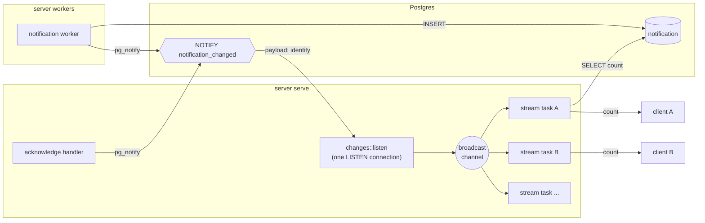
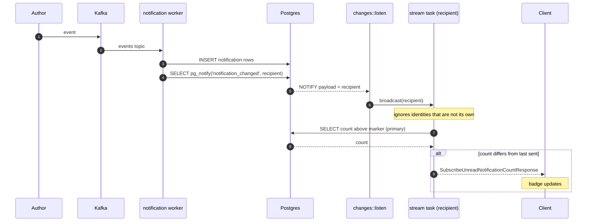
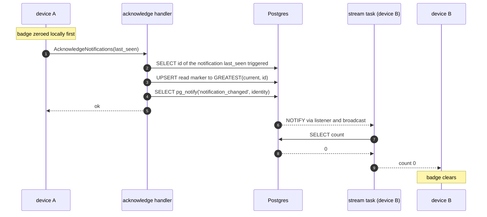
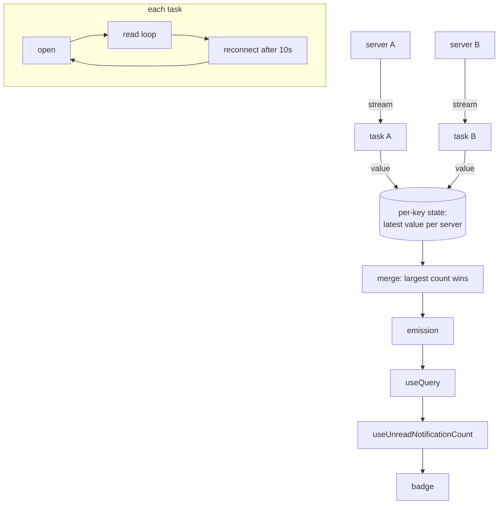

# Unread Notifications

The Notifications tab shows a counter of unread notifications. The count comes
from the servers over an open gRPC stream, so the client never polls for it.
This page describes how the count is stored, how a change reaches an open
stream, what database connections are involved, and how the client merges the
streams of several servers.

## Concepts

- **Notification row.** The `notification` table holds one row per
  notification, with an increasing `id` and the recipient in `to_identity`.
  The notification worker inserts them.
- **Read marker.** The `notification_read_marker` table holds one row per
  identity: `last_read_id`. Every notification with a higher id is unread.
  `AcknowledgeNotifications` moves the marker up to the notification the
  client names, never backwards.
- **Unread count.** Rows above the marker, counted up to 100. The client
  shows anything at the cap as `99+`.
- **Change feed.** A Postgres `NOTIFY` on the `notification_changed` channel
  with the identity as payload. Any process that writes notifications or the
  marker sends one. The server listens and fans it out to open streams.

The RPCs live in `NotificationService`:

| RPC                                | Kind             | Served by |
| ---------------------------------- | ---------------- | --------- |
| `SubscribeUnreadNotificationCount` | server streaming | server    |
| `AcknowledgeNotifications`         | unary            | server    |

Both take the identity from the bearer token, see
[Server Authentication](../protocol/server-auth.md).

## Processes and connections

The server runs as two processes against one database: `server serve` answers
RPCs and `server workers` consumes Kafka. They do not share memory, so the
change feed goes through Postgres.

**Subscriptions do not open their own Postgres connection.** Each `server
serve` process holds exactly one `LISTEN` connection, opened by
`changes::init` at startup from the write pool and kept for the life of the
process. Everything received on it is copied onto a `tokio::sync::broadcast`
channel. A subscription is a tokio task holding a receiver on that channel: no
connection, no polling. If the `LISTEN` connection drops, the listener
reconnects after five seconds. Postgres does not queue notifications sent
while nobody listens, so after every connect the listener broadcasts a
"changed for everyone" message and each open stream re-counts.

A subscription touches the pool only briefly:

| Moment                         | Connection                                  |
| ------------------------------ | ------------------------------------------- |
| Stream opens                   | one pooled connection, released after the first count |
| Change arrives for its identity| one pooled connection, released after the re-count    |
| Idle                           | none                                        |

The worker and the acknowledge handler send `NOTIFY` through their ordinary
pooled connection with `SELECT pg_notify(...)`, so they need nothing extra
either.

## A new notification

The worker notifies once per distinct recipient of the event, after all of its
rows are inserted. A failed notify is logged and does not retry the message:
the next change for that identity, or a reconnect, catches the count up.

The stream task for a recipient:

1. Receives the identity from the broadcast channel and ignores it when it is
   not its own.
2. Re-counts on the primary database. A change arrives before any read
   replica has the row, so the count must not come from `ro_db`.
3. Sends the count only when it differs from the last one it sent.

A lagged receiver (the broadcast buffer overflowed) re-counts too, since it
cannot know which identities it missed.

## Acknowledging

Opening the Notifications tab acknowledges up to the newest notification it
has shown, named by that notification's trigger event key in `last_seen`.
Anything that arrives after the list was fetched stays unread. The same path
tells every other open stream for the identity, including other devices, that
the count dropped.

The server resolves `last_seen` to its own row id, since ids differ between
servers while the trigger event key is the same everywhere. The upsert keeps
the higher of the stored and the new id, so a stale acknowledgement from a
slower device cannot move the marker backwards. A server that never produced
that notification has nothing newer the client could have seen, so it marks
everything it holds.

Device A does not wait for its own stream: the client zeroes its cached count
before the RPC and drops the rust-side cache after it, so the badge clears at
once and the next subscription starts from the server's value.

## Client fan-out

`rs-core` exposes the stream as `Query.SubscribeUnreadNotificationCount`, an
observable like every other query, so Harbor consumes it through `useQuery`.
It is the first query built on `QueryClient::subscribe` rather than `fetch`.

- **One stream per server.** Each task opens
  `SubscribeUnreadNotificationCount` on its server, with the usual server
  timeout applied to the open. Every value it reads replaces that server's
  entry in the query state and triggers an emission.
- **Merge.** Servers usually hold the same notifications, so the merged count
  is the largest per-server count rather than the sum.
- **Status.** `Loading` until every server has sent its first value, then
  `Success`. The observable never completes while subscribed.
- **Reconnect.** A stream that ends, for instance on a server deploy, or that
  fails is re-opened after ten seconds. The server sends the current count on
  every open, so a reconnect also repairs any change missed in between.
- **Unsubscribe.** Unsubscribing only flips a flag. Each task checks it once a
  second while idle and stops, which closes the HTTP stream and ends the
  server task.

The web client uses gRPC-web, which carries server streaming as a chunked
response. A proxy in front of the server must not buffer responses, or the
counts arrive only when the stream closes.

## Where the code is

| Piece                                   | Path                                                                          |
| --------------------------------------- | ----------------------------------------------------------------------------- |
| Proto                                   | `protos/polycentric/v2/notifications.proto`                                   |
| Change feed (listen, broadcast, notify) | `services/server/src/service/notifications/changes.rs`                        |
| Stream handler                          | `services/server/src/service/notifications/rpc/subscribe_unread_notification_count.rs` |
| Acknowledge handler                     | `services/server/src/service/notifications/rpc/acknowledge_notifications.rs`  |
| Worker notify                           | `services/server/src/service/notifications/worker.rs`                         |
| Count and marker queries                | `services/server/src/service/notifications/repository.rs`                     |
| Client subscription                     | `packages/rs-core/src/query/client.rs` (`subscribe`), `packages/rs-core/src/query/notification.rs` |
| Harbor hook                             | `apps/harbor/src/features/notifications/hooks/useUnreadNotificationCount.ts` |
